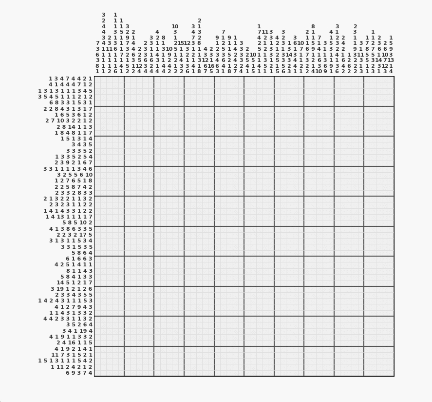

# Nonogram Solver (Python)

这是一个基于 **Python** 实现的智能数织（Nonogram / 像素涂色）自动化解题器。它结合了逻辑推导与动态规划算法，能够高效地求解各种规模的数织谜题。

### 核心功能

* **逻辑自动推导**：利用假设检验法（Contradiction）自动确定每个格子的状态（填涂、留白或未知）。
* **动态规划加速**：使用 `lru_cache` 优化的递归算法，快速判断行/列布局的可能性。
* **交互式可视化**：通过专用的 `show` 模块，记录解题的每一个步骤，并支持交互式展示解题全过程。

---

### 技术实现逻辑

该解题器采用了类似 **约束传播（Constraint Propagation）** 的机制：

1. **动态规划约束检查 (`can_place`)**：
核心算法通过递归检查当前行/列的现有状态是否能满足给定的提示数字（Blocks）。通过对搜索范围的剪枝优化，极大地提升了验证速度。
2. **双向队列更新策略 (`deque`)**：
采用 BFS（广度优先搜索）思路的队列管理。当某一行发生状态变化时，自动将受影响的列加入队列重新检查，反之亦然。这种局部更新机制避免了不必要的全局重复计算。
3. **假设检验法 (`process_line`)**：
针对每一个未知格子（状态为 0），算法会分别假设其为“黑”或“白”。如果某种假设在逻辑上无法通过动态规划的验证，则可以反向确定该格子的真实状态。
<div align="center">
  
</div>
---

### 快速开始

#### 1. 环境依赖

确保你的环境中已安装 `NumPy`和`matplotlib`：

```bash
pip install numpy
pip install matplotlib

```

#### 2. 配置谜题

在 `solve.py` 中修改 `rows`（行提示）和 `columns`（列提示）：

```python
columns = [[4], [2], [1, 1], ...]
rows = [[1, 5], [1, 3], [4], ...]

```

#### 3. 运行程序

执行主脚本，解题器将自动开始推导并弹出交互式可视化窗口：

```bash
python solve.py

```

---

### 项目结构

* `solve.py`: 包含核心解题逻辑与算法。
* `show.py`: (外部模块) 负责解题步骤的动态渲染与交互界面展示。
* `.gitignore`: 已配置忽略 `.venv` 与 `__pycache__` 等冗余文件。

---

### 💡 提示

如果你想更换谜题，只需按顺序输入每一行或每一列的提示数字列表即可。
